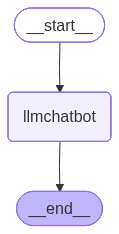
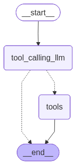
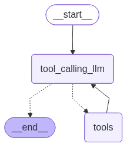

# Agentic Chatbot with LangGraph + Groq (Tool-Calling Enabled)

This project demonstrates how to build an **agentic chatbot** using:

- **LangGraph** for stateful workflow orchestration
- **Groq-hosted LLM (`openai/gpt-oss-120b`)** for high-performance inference
- **Tool Calling** with:
  - Tavily Search (web search)
  - Custom Python function (`multiply`)

The notebook walks through building:

1. A basic LLM chatbot using a `StateGraph`
2. Streaming responses
3. Tool integration (external + custom tools)
4. Conditional tool execution in a graph workflow

This project is ideal for AI/ML practitioners exploring **LLM agents, tool-calling, and graph-based orchestration**.

---

# 📌 Architecture Overview

The system is built using **LangGraph**, which models LLM workflows as directed graphs:

- **Nodes** → LLM calls or tool execution
- **Edges** → State transitions
- **State** → Conversation messages

We define a shared state:

```python
class State(TypedDict):
    messages: Annotated[list, add_messages]
```






